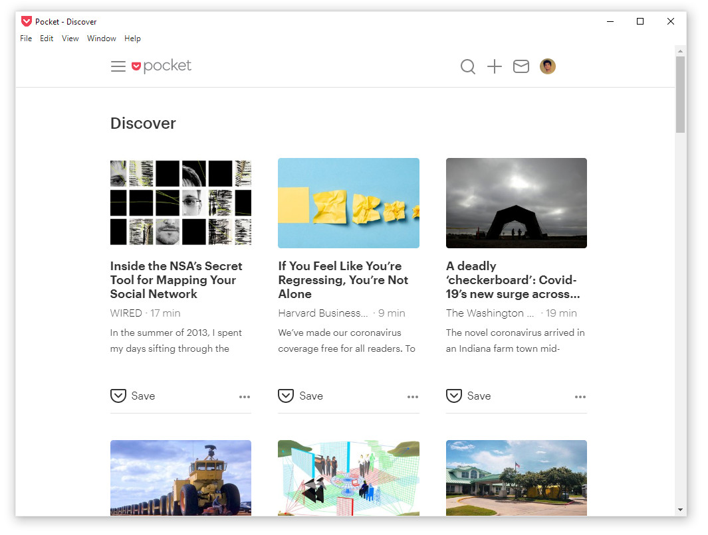
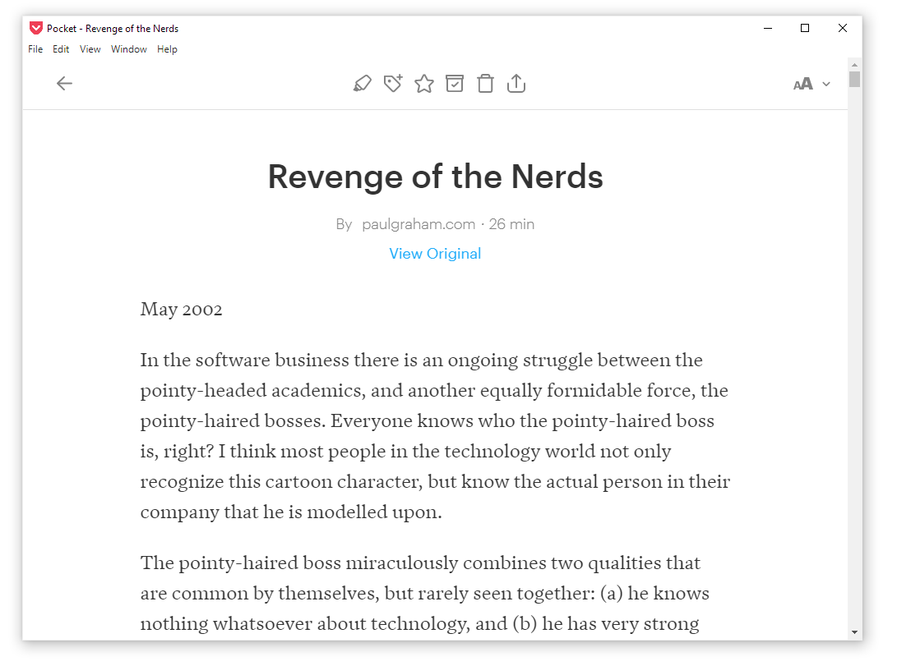

<link rel="stylesheet" type="text/css" media="all" href="http://markdowncss.github.io/modest/css/modest.css" />

# Pocket Windows

An unofficial [Pocket](https://getpocket.com/) client for Windows Desktop. Currently just an electron wrapper.






------

## Building

Clone the repo and open CMD inside:

```powershell
npm install
npm start
```

------

## Download

Release coming soon!